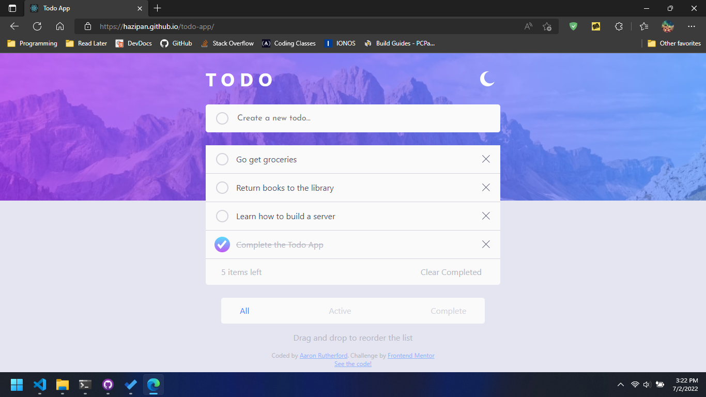

# Frontend Mentor - Todo app solution

This is a solution to the [Todo app challenge on Frontend Mentor](https://www.frontendmentor.io/challenges/todo-app-Su1_KokOW). Frontend Mentor challenges help you improve your coding skills by building realistic projects. 

## Table of contents

- [Overview](#overview)
  - [The challenge](#the-challenge)
  - [Screenshot](#screenshot)
  - [Links](#links)
- [My process](#my-process)
  - [Built with](#built-with)
  - [What I learned](#what-i-learned)
  - [Continued development](#continued-development)
- [Author](#author)rt

## Overview

### The challenge

Users should be able to:

- View the optimal layout for the app depending on their device's screen size
- See hover states for all interactive elements on the page
- Add new todos to the list
- Mark todos as complete
- Delete todos from the list
- Filter by all/active/complete todos
- Clear all completed todos
- Toggle light and dark mode
- **Bonus**: Drag and drop to reorder items on the list

### Screenshot

### Links

- Solution URL: [https://www.frontendmentor.io/solutions/todo-app-with-typescript-qA9f3Ot3km](https://www.frontendmentor.io/solutions/todo-app-with-typescript-qA9f3Ot3km)
- Live Site URL: [https://hazipan.github.io/todo-app/](https://hazipan.github.io/todo-app/)

## My process

### Built with

- CSS custom properties
- Flexbox
- Mobile-first workflow
- [React](https://reactjs.org/) - JS library

### What I learned

I learned how to react-beautiful-dnd to create a very nice drag and drop experience

### Continued development

From here I'm planning to go back to previous projects and spruce them up. Once I do that, I'm going to build a portfolio website, do a few other key projects, and begin applying for front-end development jobs.

## Author

- Gitub - [Hazipan](https://www.github.com/Hazipan)
- Frontend Mentor - [@hazipan](https://www.frontendmentor.io/profile/hazipan)
